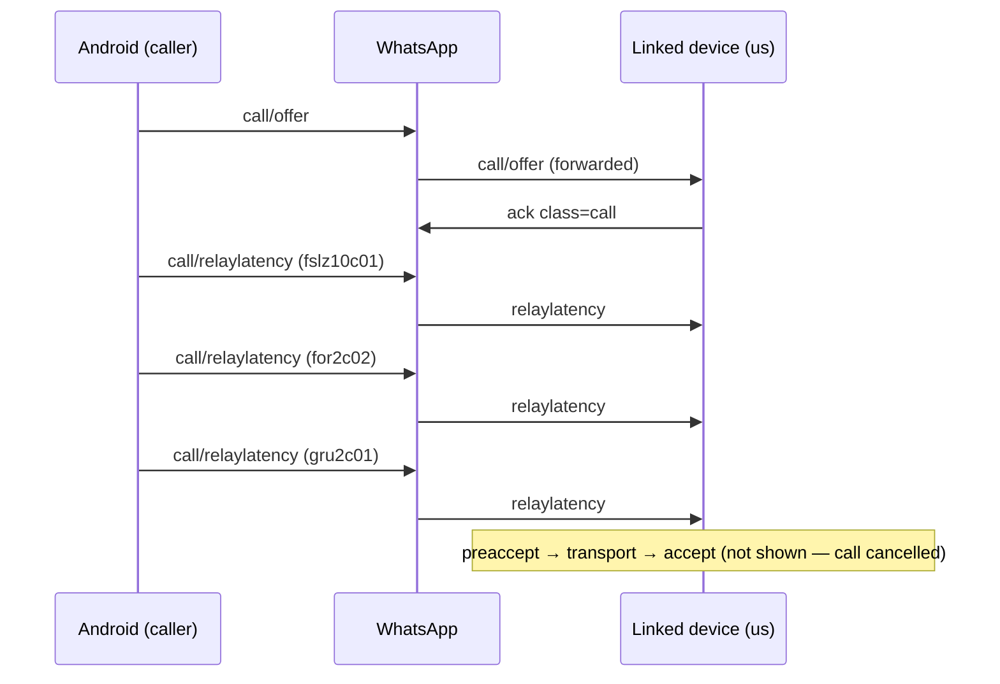

# Inbound Call Offer — Reverse Engineering (capture 2026-06-10)

Source: real inbound offer from Android (`platform=smba`, `version=2.26.21.75`) to linked device
(`5511930023692:36@s.whatsapp.net`), captured during `cmd/call-test` session.

## Envelope `<call>`

| Attribute | Value | Notes |
|-----------|-------|-------|
| `from` | `5356260450362@lid` | Peer LID (route) |
| `id` | `3F61CCE8275659D156637F63B598B8F2` | Stanza ID |
| `e` | `0` | Epoch |
| `t` | `1781066977` | Timestamp |
| `notify` | `Hyper Duck` | Push/display name |
| `platform` | `smba` | Android phone |
| `version` | `2.26.21.75` | App version |

Platform/version live on the **outer** `<call>` node, not on `<offer>`.

## Inner `<offer>` attributes

| Attribute | Value | Present in our outbound? |
|-----------|-------|--------------------------|
| `call-id` | `006D62BD6943275D0E6D0E35BE40E453` | yes |
| `call-creator` | `5356260450362@lid` | yes (our LID) |
| `caller_pn` | `559885700260@s.whatsapp.net` | **no** |
| `caller_country_code` | `BR` | **no** |
| `device_class` | `2016` | **no** |
| `joinable` | `1` | **no** |

## Child node order (critical)

```
audio → audio → capability → enc → encopt → metadata → net → rte → uploadfieldstat → voip_settings → relay
```

Our outbound order today:

```
audio → audio → capability → destination → encopt → net → voip_settings
```

## Per-child analysis

### `audio` (×2)

```xml
<audio enc="opus" rate="16000"/>
<audio enc="opus" rate="8000"/>
```

Same as ours. Codec negotiation is Opus @ 16 kHz primary, 8 kHz fallback.

### `capability`

```
Hex: 01 05 f7 09 e4 fa 13
```

| Client | Bytes |
|--------|-------|
| Android inbound (this capture) | `{1, 5, 247, 9, 228, 250, 19}` |
| Our outbound / preaccept template | `{1, 4, 247, 11, 206, 3}` |
| go-whatsapp fork | `{1, 4, 255, 131, 207, 4}` |

Capability blob is **client-specific**; do not assume a single fixed value.

### `enc` (single root — no `destination`)

```xml
<enc type="pkmsg" v="2">…230 bytes…</enc>
```

- One `enc` at offer root, **not** inside `<destination>`.
- Encrypts `waE2E.Message{Call:{callKey: <32 bytes>}}` for the callee linked device.
- `pkmsg` is normal for phone → linked device (first outbound to that device).
- Our outbound used `<destination>` with 3× `pkmsg` → server silently dropped (no ack).

**Implication for outbound linked device:** prefer single root `enc` targeted at route JID when possible;
multi-device `destination` is a web/MD pattern, not what the phone sends.

### `encopt`

```xml
<encopt keygen="2"/>
```

Same as ours.

### `metadata`

```xml
<metadata peer_abtest_bucket="" peer_abtest_bucket_id_list="118573,121932,123253"/>
```

A/B test bucket IDs for VoIP experiments. We omit this.

### `net`

```xml
<net medium="3"/>
```

Same as ours (`medium=3` = default data network).

### `rte` (route transport endpoint)

```
Content (6 bytes): 2d a2 ed 98 6b da
                   └─ IPv4 ─────┘ └port┘
```

Decoded: **45.162.237.152:27610** (IPv4 big-endian + port uint16 BE).

Likely the caller's reflexive/local transport hint (similar encoding to `te`/`te2` short form).
We do not send `rte` today.

### `uploadfieldstat`

```xml
<uploadfieldstat/>
```

Empty stub node for analytics/field stats. Safe to omit initially.

### `voip_settings`

Large JSON (~15 KB uncompressed) with sections:

| Section | Purpose |
|---------|---------|
| `aec` | Acoustic echo cancellation |
| `bwe` | Bandwidth estimation |
| `encode` | Opus encoder (`complexity`, `frame_ms`, `min_bitrate`, …) |
| `ns` | Noise suppression |
| `options` | Hundreds of feature flags (`disable_p2p=1`, relay strategy, DTX, …) |
| `rc` / `rc_dyn` | Rate control |
| `re` | Relay allocation timeouts, UDP bind retries |
| `sfu` | SRTP hop-by-hop (`enable_hbh_srtp`) |
| `uaqc` | Quality adaptation state machine |
| `vid_rc` | Video rate control (even on audio calls) |
| `voip_settings_version` | `{release_type:1, version_number:151059}` |

Our minimal JSON `{"encode":{"codec":"opus"},"options":{"disable_p2p":"1"}}` is far too small.
The WASM stack generates the full blob; hard to replicate in pure Go.

### `relay` (required for ringing + media)

```xml
<relay attribute_padding="1" peer_pid="1" self_pid="2" uuid="LKj6Tn8J1CcuhldV">
```

| Child / attr | Value | Purpose |
|--------------|-------|---------|
| `participant` | `jid=5356260450362@lid pid=1` | Caller identity in relay namespace |
| `token id=0..2` | 191–193 bytes each | STUN/TURN auth tokens (opaque) |
| `auth_token id=0..1` | ~80 bytes hex | Secondary auth material |
| `key` | `qZ86qnr33y9e/sEBJ0bOVA==` | Double-base64 relay key (16 bytes inner) |
| `hbh_key` | `1+bITNjPoH4CmtJ4S8WCMwXhiPoT8LMwHi2VcNJJ` | HMAC key for STUN (use **raw ASCII**, do not base64-decode) |
| `te2` (×6) | see below | Edge relay endpoints |

#### `te2` endpoint decoding

**Short form (6 bytes)** — IPv4 + port:

| relay_name | Hex | IP | Port |
|------------|-----|-----|------|
| fslz10c01 | `2db4d9a20d96` | 45.180.217.162 | 3478 |
| for2c02 | `3990a5390d96` | 57.144.165.57 | 3478 |
| gru2c01 | `3990e9390d96` | 57.144.233.57 | 3478 |

Port **3478** = standard STUN/TURN (Meta `edgeray-*.wt.whatsapp.com`).

**Long form (18 bytes)** — IPv6 + port, e.g.:

```
280460d403000222faceb00c33334df00d96
```

Attrs on `te2`: `relay_id`, `relay_name`, `token_id`, `auth_token_id`, `c2r_rtt`, optional `domain_name`, `is_fna`.

Relay credentials are **allocated by WhatsApp servers** (via VoIP WASM after offer ack).
Cannot be synthesized from scratch in Go-only signaling.

## Post-offer signaling flow (this capture)



`relaylatency` encodes RTT as `latency = 33554432 + rtt_ms`:

| relay_name | latency attr | Implied RTT |
|------------|--------------|-------------|
| fslz10c01 | 33554441 | 9 ms |
| for2c02 | 33554455 | 23 ms |
| gru2c01 | 33554474 | 42 ms |

Matches `c2r_rtt` on offer `te2` nodes (11, 24, 44 ms).

## Outbound vs inbound gap summary

| Feature | Inbound (phone) | Our outbound | Impact |
|---------|-----------------|--------------|--------|
| `enc` placement | Root, single | `destination` × N | **Server drops offer** |
| `relay` | Full tokens + te2 | Missing | **No ring / no media** |
| `rte` | 6-byte endpoint | Missing | Transport setup incomplete |
| `voip_settings` | ~15 KB flags | 60 bytes | Suboptimal; may matter for media |
| `metadata` | A/B buckets | Missing | Low priority |
| `caller_pn` | Present | Missing | May help routing |
| `capability` | Phone-specific | Web-specific | Different clients differ |
| Ack | N/A (we receive) | **Timeout 15s** | Offer rejected server-side |

## What pure Go can vs cannot do

**Can (signaling layer):**

- Match `audio`, `encopt`, `net`, `capability` structure
- Single root `enc` with proper Signal session (`type=msg` after message exchange)
- Parse inbound offers (`relay`, `te2`, `voip_settings`) for accept flow
- Send `relaylatency`, `preaccept`, `transport`, `accept` (whatsmeow-calls pattern)

**Cannot (without WASM / server allocation):**

- Generate valid `relay` tokens — server allocates after VoIP stack init + offer ack
- Produce full `voip_settings` JSON — extracted from WhatsApp Web WASM
- Populate `rte` without STUN binding against relay

## Recommended next steps for outbound

1. **Single root `enc`** to route JID (not multi-device `destination`) for 1:1 calls.
2. **Require `type=msg`** session (exchange messages with contact first).
3. **Integrate WASM sidecar** (baileys-caller pattern) for `relay` + full `voip_settings` generation.
4. Use `cmd/call-dump` to save full JSON of this offer for offline parsing:

```bash
go run ./cmd/call-dump
```
